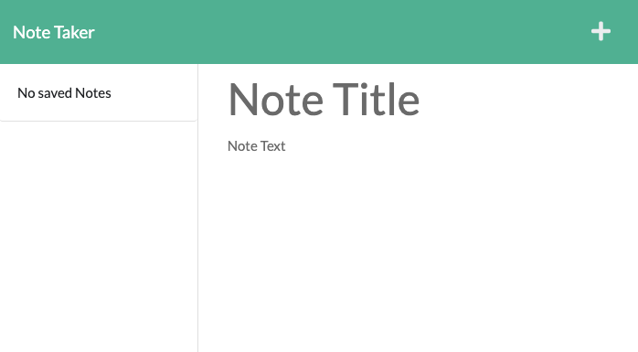

# Note Taker
  
  ## Description
  A simple note taker that uses mongoose for data modeling and vanilla javascript on the frontend. Editing notes is a future improvement.

  
  ## Table of Contents
  * [Installation](#installation)
  * [Usage](#usage)
  * [License](#license)
  * [Contributing](#contributing)
  * [Tests](#tests)
  * [GitHub](#github)

  ## Installation
  `npm install`. For development, `vercel dev`. Alternatively, use the [deployed version](https://note-taker-gamma-five.vercel.app/)

  ## Usage
  Add notes by clicking in the right column, or click the plus icon. Click the save icon to move the note to the left column. Click the trash icon to delete the note.  
  

  ## License
    
  This project uses  the [MIT](https://opensource.org/licenses/MIT) license.

  ## Contributing
  This project follows the Contributor Covenant.  
  

  ## Questions
  Reach out via email or GitHub.  
  cassie.s.simpson@gmail.com  
  [https://github.com/cassie-s](https://github.com/https://github.com/cassie-s/)
